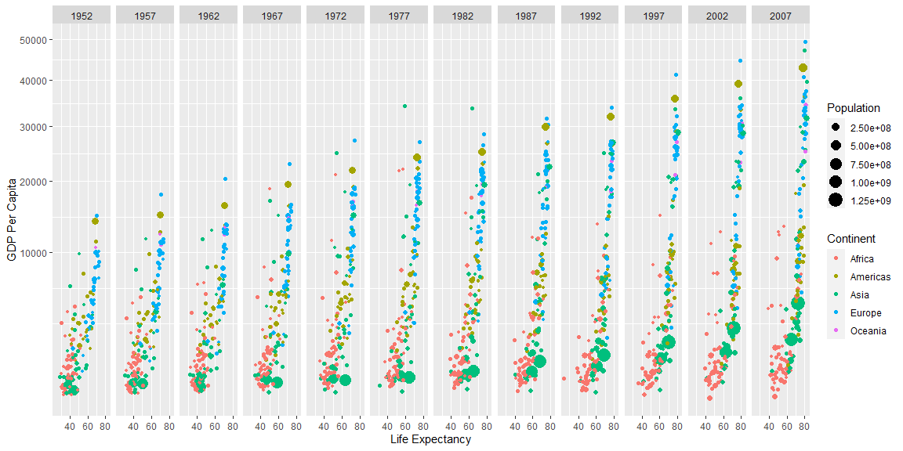

## Background and Objective

Hans Rosling is one of the most popular data scientists on the web. His original TED talk, [The best stats you’ve ever seen](https://www.ted.com/talks/hans_rosling_the_best_stats_you_ve_ever_seen) set a new bar for data visualization.

- Setup: I imported the libraries dyplyr and ggplot2 and the data gapminder as 'gap'.
- Data Wrangling: I filtered the data to exclude the country Kuwait because it was corrupted data.
- Data Visualization: I used color and scale to create a comprehensive plot that explores the relationship between GDP per capita (yaxis) and Life Expectancy(xaxis). The visualizations are sorted by every 4 years from 1952-2007. Each point represents a country from the data set. The size of each point shows the population of the country and the color shows what continent that country is in which is shown on the legend.
- Observe relationships between variables based on the visualization

## Setup
```r
# This R-chunk imports all the datasets and libraries needed for the project

library(gapminder)
gap <- gapminder
library(dplyr)
library(ggplot2)
```


## Data Wrangling


```r
# This R-Chunk cleans & wrangles the data
filteredCountries <- gap %>%
filter(country != "Kuwait")
```

## Data Visualization


```r
# This R-Chunk plots & visualizes the data
ggplot(data = filteredCountries, mapping = aes(x = lifeExp, y = gdpPercap, color = continent, size = pop/100000)) + geom_point() + facet_wrap(~year, ncol = 12) + labs(size = "Population", y = "GDP Per Capita", x = "Life Expectancy", color = "Continent") + scale_y_continuous(trans = "sqrt")
```

<!-- -->

## Relationships Observed

- GDP per capita and Life Expectancy: As a general rule as the GDP increases so does the Life Expectancy
- Year, Life expectancy, and GDP per capita: As the years come closer to the present the GDP becomes more spread out. The lowest GDPs stay about the same but the difference between the highest GDP in 1952 and the highest GDP in 2007 is significant. Because the GDP has a visible positive relationship with the year and the life expectancy it is not a surprise the life expectancy also increases with the years.
- Continent, GPD per capita, and life expectancy: Across the visualization European countries cluster at the top of both the GPD and life expectancy, while Africa sits at the bottom of both
- Population, Continent, and Year: The populations increased as the years increased. The populations are also the highest in the Asian countries.

